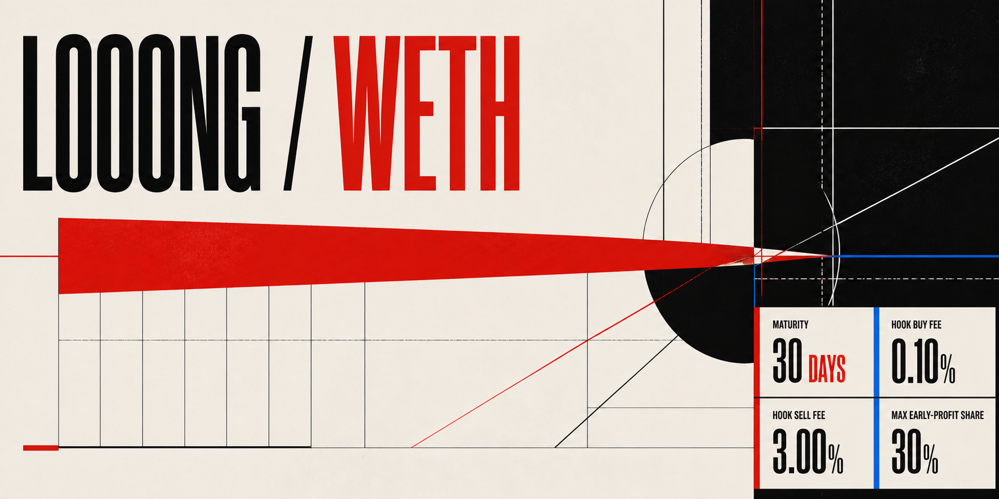

# looong-hook



`looong-hook` is the shared Uniswap v4 root behind Hookr's LOOONG token-launch mode. Each launch
creates a fixed-supply token, initializes its own token/WETH pool, and permanently locks the founding
supply in a one-sided selling band. Verified buys create non-transferable, pool-scoped positions in
hook custody. Position owners can sell from custody, withdraw their tokens, activate rewards after
30 days, and claim WETH rebates or rewards.

This repository is a reference implementation. It is not audited and it is not ready for a public
deployment.

## Protocol

- `LooongHook` owns isolated position, fee, reward, and custody accounting for every registered pool.
- `LooongRouter` authenticates position owners and routes swaps by subject token through the shared root.
- `LooongHookFactory` mines and deploys the five required hook permission bits with CREATE2.
- `LooongMarketCoordinatorV1` creates user tokens and atomically initializes and funds their pools.

The fixed values are a one-billion-token supply, a 0.30% Uniswap LP fee, a 0.10% hook buy fee, a
3.00% hook sell fee, a 30-day maturity period, and tick spacing 60. Read [`specs.md`](specs.md) for
the complete behavior and exclusions.

## Local checks

The Solidity dependencies are vendored. The TypeScript dependencies are pinned in `bun.lock`.

```sh
bun install --frozen-lockfile
./scripts/check.sh
```

The full check compiles the contracts, checks deployable sizes, runs unit, integration, fuzz, and
stateful invariant tests, type-checks the TypeScript, and builds the dapp.

## Devnet

Run the complete local deployment and the 100-wallet scenario:

```sh
./scripts/devnet-check.sh
```

The command starts Anvil, installs the shared root, launches two tokens with opposite currency
orderings through the coordinator, runs the trades across both pools, verifies protocol
conservation, and writes `reports/devnet.json`. It prints `DEVNET_OK`
only after all steps pass.

Run the dapp against the generated devnet manifest:

```sh
bun run ui:dev
```

The dapp reads `ui/public/deployment.json`. Use `ui/public/deployment.example.json` as the manifest
shape for another environment. See [`docs/hookr-integration.md`](docs/hookr-integration.md) for the
transaction and event contract Hookr must consume.

## Testnet boundary

Prepare a Sepolia dry run with:

```sh
./scripts/testnet-dry-run.sh sepolia
```

Copy `deployments/sepolia.example.json` to `deployments/sepolia.json` and replace every placeholder
before the dry run. Preparation does not authorize a broadcast. A user must separately approve and
run `scripts/testnet-deploy.sh` with a named Foundry keystore account.

## Repository map

- `src/`: shared root, router, token, market coordinator, factory, interface, and accounting library.
- `test/`: real PoolManager integration, arithmetic fuzzing, and stateful invariants.
- `script/`: local and manifest-driven deployment scripts.
- `scenarios/`: the 100-wallet Viem scenario and postcondition verifier.
- `ui/`: the Viem browser client.
- `docs/`: local workflow, security, testing, gas, dapp, devnet, and testnet rules.
- `vendor/`: pinned Solidity dependencies and provenance.

Public-network deployment still needs independent static analysis, mainnet-fork lifecycle tests,
economic review, security review, deployed-bytecode checks, source verification, and monitoring.

## License

MIT © 2026 voladelta. See [`LICENSE`](LICENSE).
